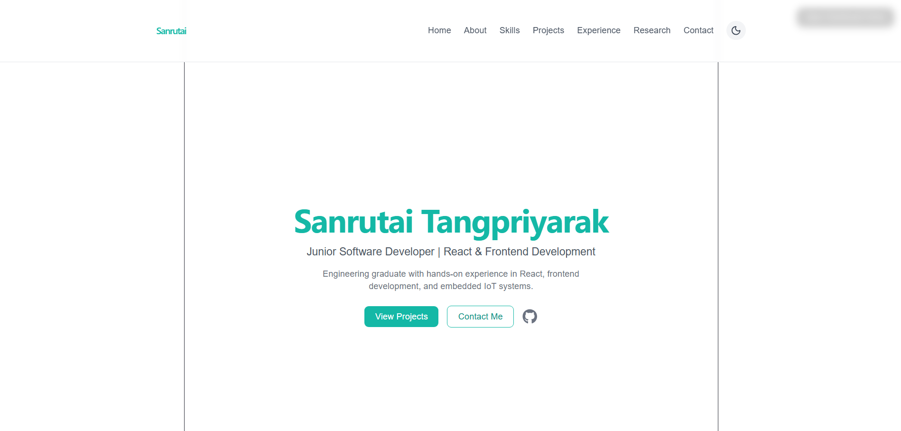

# Interactive React Portfolio (Dashboard System)
A responsive and interactive portfolio web application built with React, featuring a simulated dashboard system to demonstrate real-world frontend architecture and state management.
## Live Demo
👉 https://portfolio-sanrutai-tangpriyarak.vercel.app/

## Tech Stack
- React.js
- JavaScript (ES6+)
- Tailwind CSS
- Framer Motion
- Vercel
- Git & GitHub
  
## Features
- Portfolio ↔ Dashboard mode switching (SPA architecture)
- Interactive UI with real-time state management
- Simulated dashboard for system visualization (IoT/control concept)
- Component-based scalable structure
- Responsive design for all devices

## What I Learned
- React state management using hooks
- Component-based architecture
- UI/UX interaction design
- Deploying web applications with Vercel

## Preview

